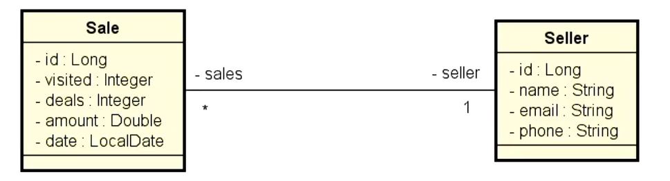

# Sistema Consulta de vendas

## Sistema desenvolvido com fins avaliativos do curso de Java Spring Profissional da DevSuperior

# Desenvolvido por Juliano Martins

  

  
  
  
  

---

# Premissas

O aluno deve realizar um fork no projeto da DevSuperior, implementar as consultas ao banco de dados 
e realizar commit em seu github pessoal para ser avaliado.

## UML do projeto

Relatório de vendas

* IN: O usuário informa, opcionalmente a data inicial, final e trecho do nome do vendedor

* OUT: O sistema informa uma listagem contendo nome do vendedor e a soma de vendas do mesmo, no período indicado

Informações complementares: 
As mesmas do caso de uso do relatório de vendas

---

---
